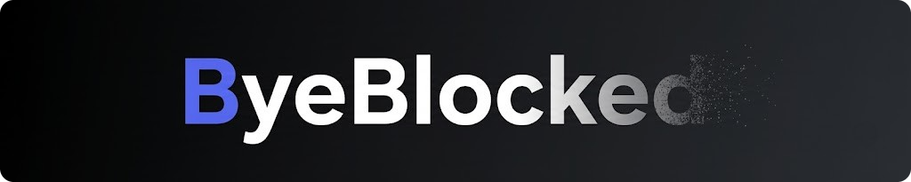

**Discord reminds you they're blocked. ByeBlocked makes you forget they exist**

## Features

- **Chat & Forum** - Hides messages, replies, mentions, forum posts, reactions and pins from blocked users
- **Voice** - Hides blocked users in real-time, mutes their mic audio, and silences their join/leave sounds
- **Calls & Group DMs** - Ignores calls from blocked users and hides them from group DMs
- **Member List** - Hides blocked profiles and empty role sections
- **Autocomplete** - Excludes blocked users from mention and invite suggestions
- **Events** - Hides blocked users from scheduled events
- **Notifications** - Suppresses the taskbar/tray badge when unread activity is only from blocked users

 

## Installation

Requires [BetterDiscord](https://betterdiscord.app) to be installed.

1. Download [`ByeBlocked.plugin.js`](https://github.com)
2. Go to **Settings > Plugins > Open Plugins Folder**
3. Drop the file in and enable it

## Feedback

Found a bug or an edge case? Feel free to open an [Issue](https://github.com).
Bug reports, feature requests, and implementation ideas are always welcome.

 

> [!WARNING]
> BetterDiscord goes against Discord's ToS. Use at your own risk.

 

MIT © [8ug8ird](https://github.com/8ug8ird) 🐦
