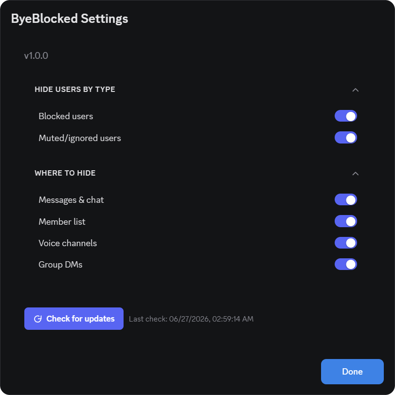

# ByeBlocked

 

  

  
Remove blocked and ignored users from chat, voice, member list, and group DMs.

## Features

- **Chat** – Hides messages, replies and mentions from blocked users
- **Voice** – Hides blocked users in real-time and fixes channel counters
- **Member List** – Hides blocked profiles and removes empty role sections
- **Group DMs** – Hides blocked recipients automatically

## Installation

1. Download [`ByeBlocked.plugin.js`](https://github.com/8ug8ird/ByeBlocked/releases/latest/download/ByeBlocked.plugin.js)
2. Go to **Settings > Plugins > Open Plugins Folder**
3. Drop the file in and enable it

> [!WARNING]
> BetterDiscord goes against Discord's ToS. Use at your own risk.

MIT © [8ug8ird](https://github.com/8ug8ird) 🐦
