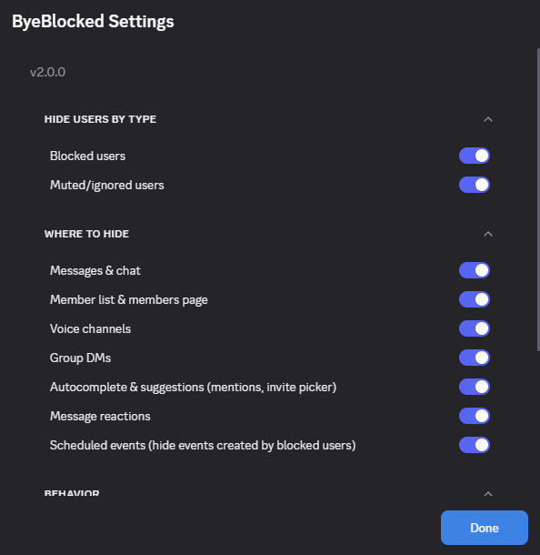
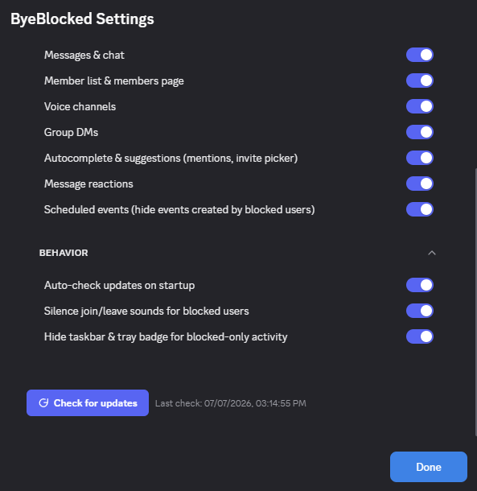

# ByeBlocked

  
  

 

Remove blocked and ignored users from your Discord view

## Features

- **Chat & Forum** - Hides messages, replies, mentions, forum posts, reactions and pins from blocked users
- **Voice** - Hides blocked users in real-time, fixes channel counters, and silences their join/leave sounds
- **Member List & Group DMs** - Hides blocked profiles, empty role sections, and group DM recipients
- **Autocomplete & Events** - Excludes blocked users from mention/invite suggestions and scheduled events
- **Notifications** - Suppresses the taskbar/tray badge when unread activity is only from blocked users

## Installation

1. Download [`ByeBlocked.plugin.js`](https://github.com/8ug8ird/ByeBlocked/releases/latest/download/ByeBlocked.plugin.js)
2. Go to **Settings > Plugins > Open Plugins Folder**
3. Drop the file in and enable it

> [!WARNING]
> BetterDiscord goes against Discord's ToS. Use at your own risk.

MIT © [8ug8ird](https://github.com/8ug8ird) 🐦
